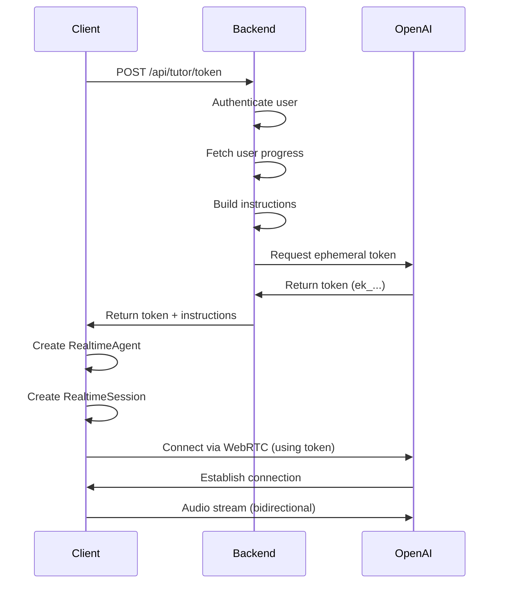

# OpenAI Realtime API Architecture

## Overview

This document describes the implementation of the OpenAI Realtime API using the official OpenAI Agents SDK (`@openai/agents`). The architecture follows the recommended patterns from the [Voice Agents Quickstart](https://openai.github.io/openai-agents-js/guides/voice-agents/quickstart/).

## Architecture Pattern

### Backend (Server-Side)
**File**: `app/api/tutor/token/route.ts`

The backend is responsible for:
1. **Authentication**: Verifying the user via Clerk
2. **Data Fetching**: Retrieving user's learning progress from the database
3. **Personalization**: Building custom instructions based on user's vocabulary progress
4. **Token Generation**: Creating ephemeral client tokens for secure WebRTC connections

```typescript
// Generate ephemeral token
const response = await fetch('https://api.openai.com/v1/realtime/client_secrets', {
  method: 'POST',
  headers: {
    'Authorization': `Bearer ${process.env.OPENAI_API_KEY}`,
    'Content-Type': 'application/json',
  },
  body: JSON.stringify({
    session: {
      type: 'realtime',
      model: 'gpt-realtime',
    },
  }),
});

// Return ephemeral token (starts with "ek_") to client
return { apiKey: data.value, instructions, userContext };
```

### Frontend (Client-Side)
**File**: `app/(app)/tutor/page.tsx`

The frontend uses the OpenAI Agents SDK classes:

1. **RealtimeAgent**: Defines the AI agent's behavior and instructions
2. **RealtimeSession**: Manages the WebRTC connection, audio processing, and conversation lifecycle

```typescript
// Create agent with personalized instructions
const agent = new RealtimeAgent({
  name: "Study Tutor",
  instructions: instructions, // From backend
});

// Create session with agent and configuration
const session = new RealtimeSession(agent, {
  model: "gpt-realtime",
  config: {
    voice: "alloy",
    modalities: ["audio"],
    // ... other config
  }
});

// Connect using ephemeral token
await session.connect({ apiKey });
```

## Security Model

### Why Ephemeral Tokens?

The Realtime API runs in the browser, which means:
- ❌ Cannot use server-side API keys directly (security risk)
- ✅ Must use ephemeral tokens generated on the backend

**Ephemeral Token Flow**:
1. Client requests token from `/api/tutor/token`
2. Backend validates user authentication
3. Backend generates short-lived token from OpenAI
4. Client uses token to establish WebRTC connection
5. Token expires after a short period

### Token Format
- Ephemeral tokens start with `ek_` prefix
- Regular API keys start with `sk_` prefix
- Ephemeral tokens are time-limited and session-specific

## Key Components

### 1. RealtimeAgent
Defines the AI agent's personality and behavior:
```typescript
const agent = new RealtimeAgent({
  name: "Study Tutor",
  instructions: "You are a helpful vocabulary tutor...",
});
```

### 2. RealtimeSession
Manages the real-time connection and conversation:
```typescript
const session = new RealtimeSession(agent, {
  model: "gpt-realtime",
  config: { /* audio and VAD settings */ }
});
```

### 3. Event Listeners
The session emits events for conversation tracking:
```typescript
session.on("conversation.item.appended", (event) => {
  // Handle user input
});

session.on("conversation.item.completed", (event) => {
  // Handle assistant response
});

session.on("error", (error) => {
  // Handle errors
});
```

## Personalization Features

The backend generates personalized instructions based on:
- **Reviewed words**: Words the user has studied
- **Test performance**: Recent test results and grades
- **Learning progress**: Total counts and patterns

This context is embedded in the agent's instructions to provide:
- Targeted vocabulary practice
- Focus on challenging words
- Contextual examples and usage
- Adaptive teaching strategies

## Connection Flow



## Configuration Options

### Audio Settings
- **Input/Output Format**: PCM16 (16-bit PCM audio)
- **Modalities**: Audio-only (can be extended to text)
- **Voice**: "alloy" (can be changed to other OpenAI voices)

### Voice Activity Detection (VAD)
- **Type**: Server-side VAD
- **Threshold**: 0.5 (sensitivity)
- **Prefix Padding**: 300ms (audio before speech)
- **Silence Duration**: 200ms (pause detection)

### Model Settings
- **Temperature**: 0.8 (creativity level)
- **Max Tokens**: 4096 (response length limit)
- **Transcription**: Whisper-1 (for input audio)

## Best Practices

1. **Always generate tokens on the backend** - Never expose API keys to the client
2. **Personalize instructions** - Use user context for better tutoring
3. **Handle errors gracefully** - Implement proper error handling and user feedback
4. **Clean up sessions** - Always close sessions when done to free resources
5. **Monitor token expiration** - Regenerate tokens as needed for long sessions

## Dependencies

```json
{
  "@openai/agents": "^0.2.1",
  "zod": "^3.25.76"
}
```

## References

- [OpenAI Agents SDK Documentation](https://openai.github.io/openai-agents-js/)
- [Voice Agents Quickstart](https://openai.github.io/openai-agents-js/guides/voice-agents/quickstart/)
- [Realtime API Guide](https://platform.openai.com/docs/guides/realtime)
